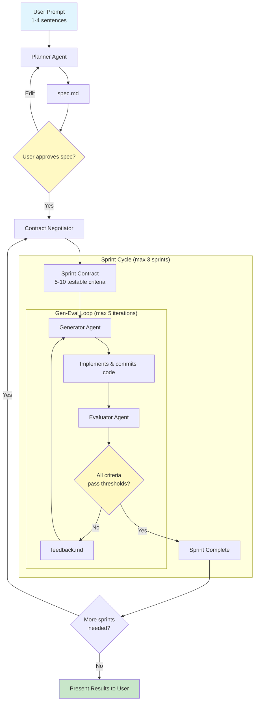
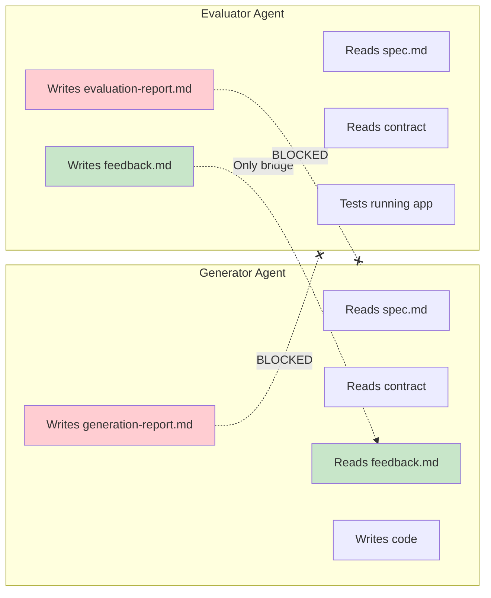
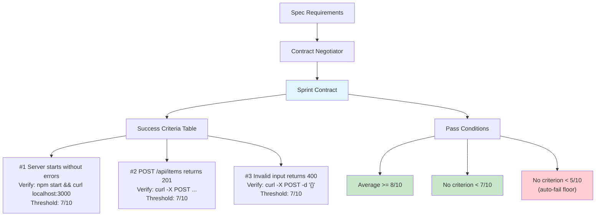

# Harness Builder — Claude Code Plugin

A Claude Code plugin that builds complete applications from brief prompts using a GAN-inspired multi-agent architecture. Based on Anthropic's engineering article [Harness Design for Long-Running Apps](https://www.anthropic.com/engineering/harness-design-long-running-apps).

## The Problem

When AI agents work on long tasks, two failure modes emerge:

1. **Context Loss** — Models lose coherence as context windows fill up
2. **Self-Evaluation Bias** — Agents praise their own mediocre work

## The Solution

Separate generation from evaluation using three specialized agents with file-based communication:



### Key Design Principles

- **Information firewall**: Generator never sees evaluator's reasoning; evaluator never sees generator's self-assessment
- **Sprint contracts**: Testable success criteria agreed upon before implementation
- **File-based communication**: Each agent gets fresh context, reads only what it needs
- **Hard thresholds**: Average score >= 8/10, no criterion below 7/10

## The Information Firewall



The generator and evaluator never see each other's internal reasoning. Only `feedback.md` (actionable instructions) bridges them. This prevents:
- **Gaming**: Generator can't learn to exploit evaluator's scoring logic
- **Anchoring**: Evaluator isn't biased by generator's self-scores

## Installation

### Local development / testing

```bash
git clone https://github.com/vamgan/claude-harness-builder.git
claude --plugin-dir ./claude-harness-builder
```

### Install from a marketplace

If this plugin is added to a marketplace you have configured:

```
/plugins install claude-harness-builder
```

### Manual per-session load

```bash
git clone https://github.com/vamgan/claude-harness-builder.git
claude --plugin-dir /path/to/claude-harness-builder
```

## Usage

The skill triggers automatically in Claude Code when you say things like:

- "Build me a recipe sharing app"
- "Create an app that tracks my workouts"
- "Implement a dashboard from scratch"

Or invoke it directly as `/claude-harness-builder:harness-builder`.

The skill will:

1. Expand your brief prompt into a full product spec
2. Present the spec for your approval
3. Negotiate sprint contracts with testable criteria
4. Build iteratively with independent quality evaluation
5. Loop until quality thresholds are met or present results for your decision

## Plugin Structure

```
claude-harness-builder/
├── .claude-plugin/
│   └── plugin.json                        # Plugin manifest
├── skills/
│   └── harness-builder/
│       ├── SKILL.md                       # Main orchestrator instructions
│       ├── agents/
│       │   ├── planner-prompt.md          # Expands prompt → product spec
│       │   ├── generator-prompt.md        # Implements iteratively
│       │   ├── evaluator-prompt.md        # Independent QA with evidence
│       │   └── contract-negotiator-prompt.md  # Negotiates testable criteria
│       ├── references/
│       │   ├── sprint-contract-schema.md  # Contract format and examples
│       │   ├── communication-protocol.md  # File layout and firewall rules
│       │   └── grading-rubric.md          # Scoring calibration (1-10)
│       └── scripts/
│           └── init-harness.sh            # Creates .harness/ workspace
├── README.md
└── .gitignore
```

## Sprint Contracts

Before implementation, criteria are negotiated between Generator and Evaluator:



## Scoring

| Score | Label | Definition |
|-------|-------|-----------|
| 10 | Exceptional | Beyond requirements, edge cases handled, polished |
| 8-9 | Good-Excellent | Fully meets requirements, no/trivial issues |
| 7 | Acceptable | Meets requirements with minor issues (minimum pass) |
| 5-6 | Below threshold | Partial, notable gaps |
| 3-4 | Poor | Major issues, barely functional |
| 1-2 | Failing | Non-functional |

### Iteration Limits

- Max 5 iterations per sprint
- Max 3 sprints per build
- If thresholds aren't met: user decides next steps

## Credits

Based on the [Harness Design for Long-Running Apps](https://www.anthropic.com/engineering/harness-design-long-running-apps) article from Anthropic Engineering, which describes a GAN-inspired approach to separating generation from evaluation in AI agent workflows.

## License

MIT
