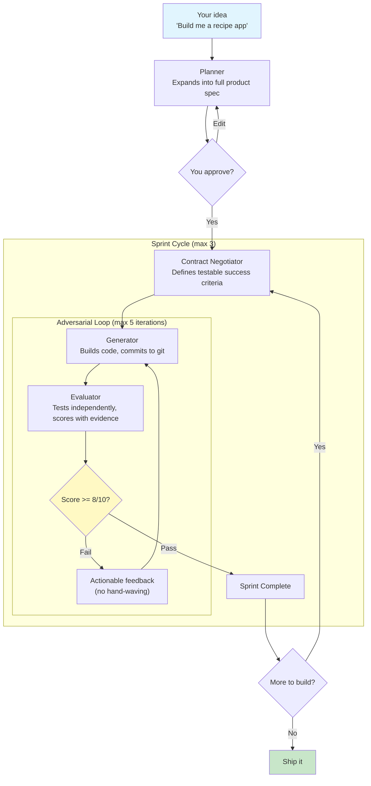
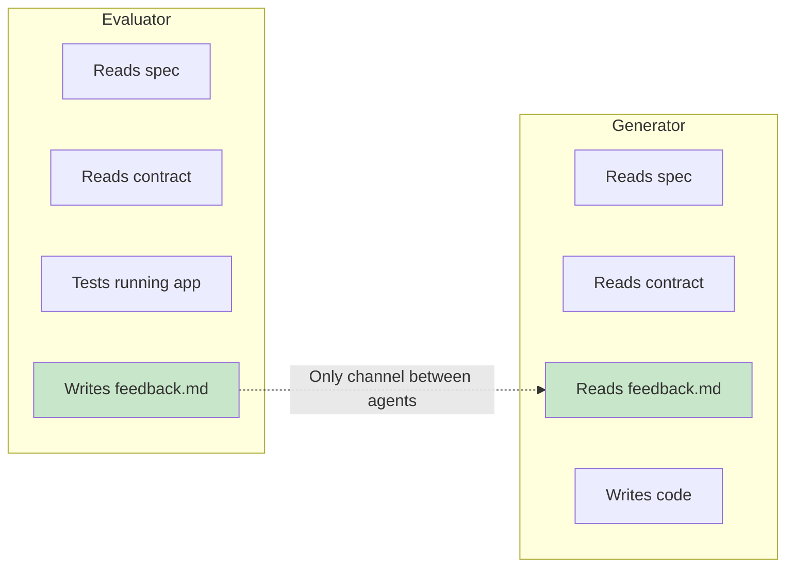

# Harness Builder — Claude Code Plugin

> **Your AI agent grades its own homework. It gets an A every time. The work is still broken.**
>
> This plugin fixes that.

## What If Claude Could Actually QA Itself?

Every developer using AI hits the same wall: you ask it to build something, it says "Done!", and half the features are broken. You point out the bugs, it says "Fixed!", and introduces new ones. The agent *literally cannot tell* when its own work is mediocre.

**Harness Builder** uses the same [GAN-inspired architecture from Anthropic's engineering team](https://www.anthropic.com/engineering/harness-design-long-running-apps) to split Claude into adversarial agents — one builds, one breaks. The builder never sees the evaluator's reasoning. The evaluator never sees the builder's excuses. Only hard evidence and scores decide if the code ships.

The result: **production-quality apps from a 2-sentence prompt.**

## Install in 30 Seconds

**Step 1:** Add the marketplace
```
/plugin marketplace add https://github.com/vamgan/claude-harness-builder.git
```

**Step 2:** Install the plugin
```
/plugin install claude-harness-builder@claude-harness-builder-dev
```

That's it. Or load directly for testing:
```bash
claude --plugin-dir /path/to/claude-harness-builder
```

**For your whole team** — drop this in `.claude/settings.json`:
```json
{
  "extraKnownMarketplaces": {
    "claude-harness-builder-dev": {
      "source": {
        "source": "url",
        "url": "https://github.com/vamgan/claude-harness-builder.git"
      }
    }
  },
  "enabledPlugins": {
    "claude-harness-builder@claude-harness-builder-dev": true
  }
}
```

## How It Works

You type a prompt. Four agents do the rest:



### The Before and After

| Without Harness Builder | With Harness Builder |
|------------------------|---------------------|
| Agent builds and self-approves | Separate agents build and evaluate |
| "Looks good to me!" on broken code | Scores backed by actual command output |
| You manually QA everything | Independent evaluator catches what the builder missed |
| 1 attempt, pray it works | Up to 15 automatic refinement cycles |
| Vague "I fixed it" responses | Sprint contracts with testable criteria before any code is written |

## The Secret: Information Firewall



The Generator **never** sees the Evaluator's internal scores or reasoning. The Evaluator **never** sees the Generator's self-assessment. This prevents:

- **Gaming** — the builder can't learn to exploit the evaluator's scoring logic
- **Anchoring** — the evaluator isn't biased by the builder claiming "9/10"
- **Rubber-stamping** — the evaluator tests with real commands, not vibes

## Sprint Contracts: No More "Trust Me, It Works"

Before a single line of code is written, agents negotiate **testable success criteria**:

| # | Criterion | How It's Verified | Pass Threshold |
|---|-----------|-------------------|----------------|
| 1 | Server starts without errors | `npm start && curl localhost:3000` | 7/10 |
| 2 | POST /api/recipes returns 201 | `curl -X POST -d '{"name":"test"}'` | 7/10 |
| 3 | Search filters by ingredient | `curl /api/recipes?ingredient=tomato` | 7/10 |
| 4 | Invalid input returns 400 | `curl -X POST -d '{}'` | 7/10 |

**Pass conditions:** Average >= 8/10. No criterion below 7/10. Any criterion below 5 = automatic fail.

No subjective hand-waving. No "the code looks clean." Every criterion is verified with an actual command.

## Usage

Just tell Claude what to build:

```
Build me a recipe sharing app where users can post recipes and search by ingredient
```

The harness activates automatically. Or invoke directly: `/claude-harness-builder:harness-builder`

It also triggers on:
- "Build me a..."
- "Create an app that..."
- "Implement from scratch..."
- "Make this production-ready"

## Plugin Structure

```
claude-harness-builder/
├── .claude-plugin/
│   └── plugin.json                           # Plugin manifest
├── skills/
│   └── harness-builder/
│       ├── SKILL.md                          # Orchestrator
│       ├── agents/
│       │   ├── planner-prompt.md             # Prompt → full spec
│       │   ├── generator-prompt.md           # Iterative builder
│       │   ├── evaluator-prompt.md           # Adversarial QA
│       │   └── contract-negotiator-prompt.md # Success criteria
│       ├── references/
│       │   ├── sprint-contract-schema.md     # Contract format
│       │   ├── communication-protocol.md     # Firewall rules
│       │   └── grading-rubric.md             # Scoring calibration
│       └── scripts/
│           └── init-harness.sh               # Workspace setup
├── README.md
└── .gitignore
```

## Based On

[Harness Design for Long-Running Apps](https://www.anthropic.com/engineering/harness-design-long-running-apps) — Anthropic Engineering's research on why the key to quality AI output is making sure the builder and the critic can never collude.

## License

MIT
