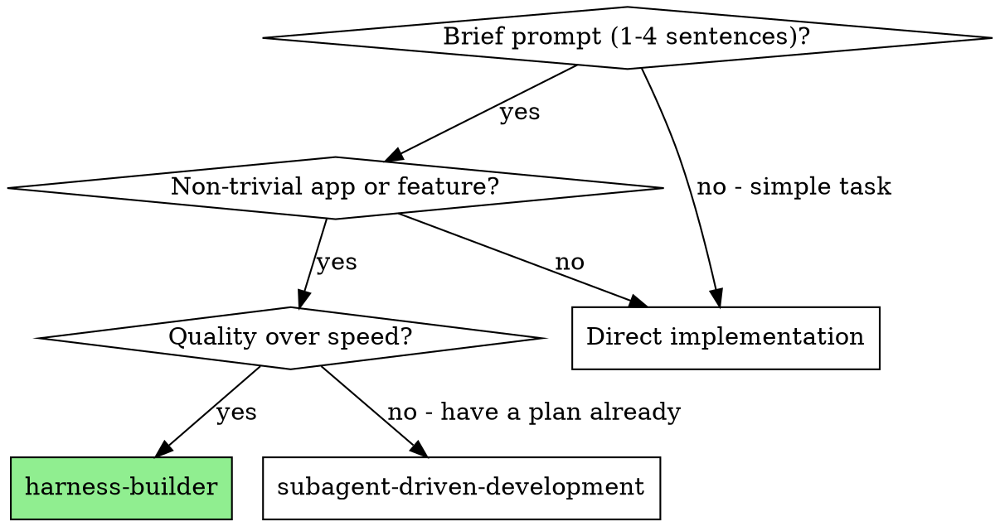
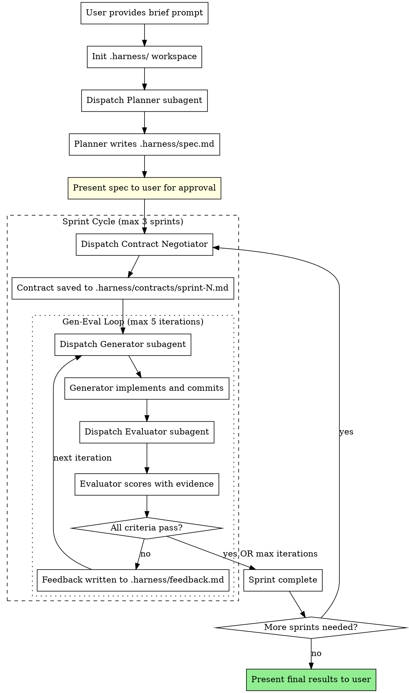

# Harness Builder

Build complete applications from brief prompts using a GAN-inspired multi-agent architecture that separates generation from evaluation.

**Core principle:** A generator that grades its own work produces mediocre output. Use independent evaluation with hard thresholds and negotiated success criteria (sprint contracts) to drive iterative improvement.

**Announce at start:** "I'm using the harness-builder skill to build this with independent quality evaluation."

## When to Use



## The Three Agents

| Agent | Role | Reads | Writes |
|-------|------|-------|--------|
| **Planner** | Expands brief prompt into full product spec | User prompt | `.harness/spec.md` |
| **Contract Negotiator** | Creates testable success criteria per sprint | Spec, prior eval reports | `.harness/contracts/sprint-N.md` |
| **Generator** | Implements iteratively, commits with git | Spec, contract, `feedback.md` | Code, `.harness/generation-report.md` |
| **Evaluator** | Independently tests using tools, scores with evidence | Spec, contract, running app | `.harness/evaluation-report.md`, `.harness/feedback.md` |

## The Workflow



## File-Based Communication

All agent communication flows through `.harness/`. Run `scripts/init-harness.sh` to create the workspace.

```
.harness/
├── spec.md                  # Product specification (Planner output)
├── contracts/
│   └── sprint-N.md          # Sprint contract for sprint N
├── generation-report.md     # Generator's self-assessment (overwritten each iteration)
├── evaluation-report.md     # Evaluator's grading with evidence (overwritten each iteration)
├── feedback.md              # Evaluator's actionable feedback for generator (overwritten each iteration)
└── history.md               # Append-only log of all iterations with scores
```

Read `references/communication-protocol.md` for the full information firewall rules.

## Sprint Contract Negotiation

Before any implementation begins, the Contract Negotiator creates testable success criteria that both Generator and Evaluator will use. Read `references/sprint-contract-schema.md` for format details.

Each contract includes:
- 5-10 testable criteria with verification methods
- Tools the evaluator will use (shell commands, file reads, HTTP requests)
- Pass conditions (thresholds)
- Scope boundaries (what's in and out for this sprint)

For Sprint 1: focus on core functionality (MVP).
For Sprint 2+: address gaps from prior sprints, add remaining features.

## Quality Thresholds

Default pass conditions (can be overridden per sprint contract):

| Condition | Threshold |
|-----------|-----------|
| Each individual criterion | >= 7/10 |
| Overall average | >= 8/10 |
| Automatic fail floor | Any criterion < 5/10 |

Read `references/grading-rubric.md` for detailed scoring calibration with examples.

## Orchestrator Responsibilities

You (the main session) are the orchestrator. Your job:

1. **Initialize workspace** — Run `scripts/init-harness.sh` before dispatching any agents
2. **Dispatch agents sequentially** — Planner first, then contract negotiator, then generator/evaluator loop
3. **Enforce the information firewall:**
   - Generator reads: `spec.md`, `contracts/sprint-N.md`, `feedback.md`
   - Generator NEVER reads: `evaluation-report.md`
   - Evaluator reads: `spec.md`, `contracts/sprint-N.md`, running application
   - Evaluator NEVER reads: `generation-report.md`
4. **Present spec to user** — After planner finishes, show spec summary and ask for approval before proceeding
5. **Track iterations** — Use TodoWrite. Max 5 iterations per sprint, max 3 sprints
6. **Handle max iterations** — If thresholds not met after 5 iterations, present current state to user with honest assessment. Let user decide: continue, adjust thresholds, or accept as-is
7. **Append to history** — After each evaluation, append sprint/iteration number and scores to `.harness/history.md`

## Dispatching Agents

When dispatching each subagent, provide:

**Planner** (use `./agents/planner-prompt.md` as template):
- The user's original prompt verbatim
- The project working directory

**Contract Negotiator** (use `./agents/contract-negotiator-prompt.md` as template):
- Sprint number
- Path to spec file
- Previous evaluation report path (if sprint > 1)

**Generator** (use `./agents/generator-prompt.md` as template):
- Sprint and iteration number
- Paths to: spec, sprint contract, feedback (if iteration > 1)
- Project working directory

**Evaluator** (use `./agents/evaluator-prompt.md` as template):
- Sprint and iteration number
- Paths to: spec, sprint contract
- Project working directory
- How to start/access the running application

## Red Flags

Never:
- Let generator grade its own work as the final verdict
- Skip contract negotiation
- Continue past max iterations without user input
- Hide evaluator failures from the user
- Let evaluator access generator's self-review (independence is critical)
- Let generator access evaluator's full reasoning (only feedback.md)
- Start implementation without user approving the spec
- Dispatch generator and evaluator in parallel (they are sequential)
